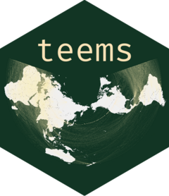

# teems 

<!-- badges: start -->
[](https://www.gnu.org/licenses/agpl-3.0)
[](https://cran.r-project.org/)
<!-- badges: end -->

**Trade and Environment Equilibrium Modeling System** --- an open-source R
package for reproducible Computable General Equilibrium (CGE) model runs.

TEEMS provides a complete pipeline from raw GTAP data through model solution:
data loading, aggregation, model parsing, shock specification, and
Docker-based solving --- all from R.

> **Status:** Beta (v0.1.0)

## Overview

| Function | Purpose |
|:---------|:--------|
| `ems_data()` | Load and prepare data inputs |
| `ems_model()` | Parse and modify model and closure files |
| `ems_uniform_shock()`/`ems_custom_shock()`/`ems_scenario_shock()` | Prepare shocks |
| `ems_swap()` | Prepare closure swaps |
| `ems_deploy()` | Validate and write all model inputs |
| `ems_solve()` | Configure and solve model |
| `ems_compose()` | Compose model results into structured data objects |
| `ems_option_set()`/`ems_option_get()`/`ems_option_reset()` | Get, set, and reset advanced package options |
| `ems_example()` | Write teems example models and scripts to file |
| `solve_in_situ()` | Configure and solve model in-situ |
| `GTAP_convert()` | Convert GTAP HAR files and data formats |

## Installation

### Prerequisites

- **R** (>= 4.3.0)
- **Docker** --- required for `ems_solve()` (see [teems-solver](https://github.com/teemsphere/teems-solver))
- **Solver build** --- required for `ems_solve()` (see [teems-solver](https://github.com/teemsphere/teems-solver))

### Install from GitHub

```r
# install.packages("remotes")
remotes::install_github("teemsphere/teems-R@v0.1.0")
```

If the installation fails citing a missing package, install that package first
and retry.

## Quick start

```r
library(teems)

# 1. Load and aggregate data
dat <- ems_data(
  dat_input = "v7_data/gsdfdat.har",
  par_input = "v7_data/gsdfpar.har",
  set_input = "v7_data/gsdfset.har",
  REG  = "AR5",
  ACTS = "macro_sector",
  ENDW = "labor_agg",
  time_steps = c(0, 1, 2, 3)
)

# 2. Retrieve a model
model_files <- ems_example("GTAP-RE", tempdir())

# 3. Load model and closure
model <- ems_model(model_file = model_files[["model_file"]],
                   closure_file = model_files[["closure_file"]])

# 4. Define shocks
shock <- ems_uniform_shock(var = "pop",
                           REGr = "lam",
                           value = 1)

# 5. Validate and write solver inputs
cmf_path <- ems_deploy(.data = dat,
                       model = model,
                       shock = shock)

# 6. Solve
results <- ems_solve(cmf_path = cmf_path,
                     solution_method = "mod_midpoint"
                     matrix_method = "SBBD",
                     n_subintervals = 2,
                     n_tasks = 2)
```

## Data requirements

TEEMS works with [GTAP](https://www.gtap.agecon.purdue.edu/) FlexAgg data.

## Documentation

Full documentation is available at
**[teemsphere.github.io](https://teemsphere.github.io/)**.

## Related repositories

| Repository | Description |
|:-----------|:------------|
| [teems-models](https://github.com/teemsphere/teems-models) | Vetted models and their standard closures |
| [teems-solver](https://github.com/teemsphere/teems-solver) | C/Fortran optimization solver (Docker) |
| [teems-mappings](https://github.com/teemsphere/teems-mappings) | Regional and sectoral aggregation mappings |
| [teems-manual](https://teemsphere.github.io/) | Full package documentation |

## License

AGPL-3.0 --- see [LICENSE.md](LICENSE.md) for details.

## Contact

**Matthew Cantele** --- [matthew.cantele@protonmail.com](mailto:matthew.cantele@protonmail.com)
